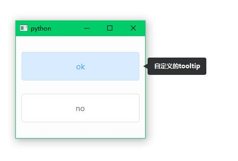

# 简介

> 通过反射将原本的的tooltip反射成自定义的弹窗样式。



# 使用

## 在Sherry框架中使用

1. 在项目下新建precondition.py（如果还没有的话）

2. 在文件中添加以下代码

```python
from sherry.variable.precondition import *

from sherry_tooltip import TooltipAgent

# 使用Sherry加载器初始化TooltipAgent
TaskDispatcher.update({
    "tooltip_hook": (TooltipAgent, (), {}),
})

```

3. 启动你的项目即可实现tooltip hook

## 在非Sherry框架中使用

1. 在项目的main.py（可以是其他的启动目录）的开始部分进行tooltip 反射

2. 如下

```python
import sys

from PyQt5.QtWidgets import QPushButton, QVBoxLayout, QApplication, QDialog

from sherry_tooltip import TooltipAgent

if __name__ == '__main__':
    TooltipAgent()
    app = QApplication(sys.argv)
    widget = QDialog()
    widget.resize(100, 200)
    widget.setToolTip("ces")

    layout = QVBoxLayout(widget)

    button = QPushButton(widget)
    button.setText("ok")
    button.setToolTip("123")
    layout.addWidget(button)

    button1 = QPushButton(widget)
    button1.setText("no")
    button1.setToolTip("sss")
    layout.addWidget(button1)
    widget.setLayout(layout)

    widget.exec_()
    sys.exit(app.exit())

```

# 如何使用自定义的tooltip？

继承ToolTip或者CustomTooltip在你想修改的方法上进行重写